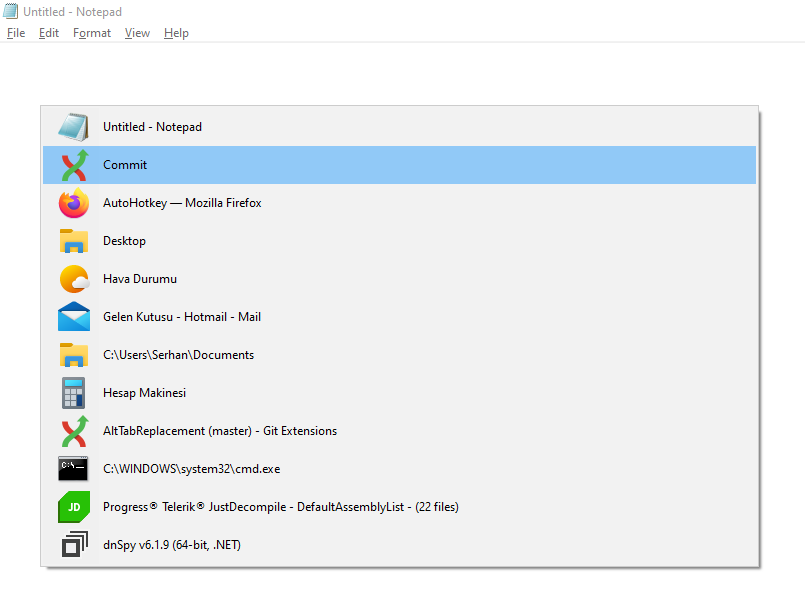

# AltTab Replacer

Replaces the AltTab menu with an AutoHotkey [Menu](https://www.autohotkey.com/docs/commands/Menu.htm).

`UWPIconExtractor.dll` is required in order to get icons of Windows UWP processes.

Limitations:

* It is necessary to press <kbd>Enter</kbd> in order to switch to the Window associated with the highlighted menu item.
* Does not support pressing <kbd>Del</kbd> key to close a window.
